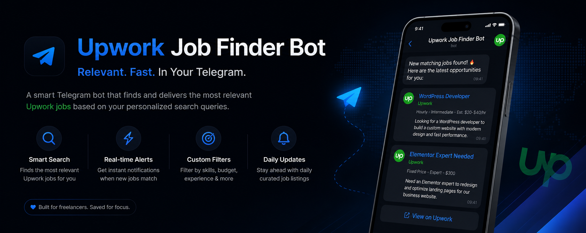

# Telegram Upwork Job Bot



A powerful, lightweight, and dependency-free Node.js Telegram bot designed to fetch, filter, and deliver new Upwork jobs matching your search criteria directly to your Telegram chat, group, or channel in real-time. Never miss a job opportunity again!

## 🚀 Features

- **Real-time Monitoring:** Polls Upwork GraphQL API for newly posted jobs.
- **Customizable Search Filters:** Filter by keywords, budget range, job type (hourly or fixed), client payment verification status, client rating, and minimum posted jobs.
- **Detailed Telegram Notifications:** Delivers rich HTML messages containing job title, description snippet, budget/hourly rate, client country, rating, verification status, and a direct link to the job post.
- **Priority Scoring:** Automatically calculates a value score for each job based on keywords, hourly rates, and client feedback.
- **Duplicate Prevention:** Uses a local JSON database (`data/seen_jobs.json`) to guarantee no duplicate alerts.

## 🛠️ Built With

* [Node.js (v20+)](https://nodejs.org/) - Built using native APIs, requiring **zero** external `npm` dependencies.
* [Upwork GraphQL API v3](https://developers.upwork.com/) - High-performance queries with precise filters.
* [Telegram Bot API](https://core.telegram.org/bots/api) - Fast and secure HTML-styled notifications.

## 🏁 Getting Started

Follow these steps to set up and run your own Telegram Upwork Bot.

### Prerequisites

1. **Node.js:** Make sure Node.js v20.0.0 or higher is installed.
2. **Upwork API Key:** Get your `Client ID` and `Client Secret` from the Upwork Developer Portal.
3. **Telegram Bot Token:** Create a bot via [@BotFather](https://t.me/BotFather) and copy the HTTP API Token.
4. **Telegram Chat ID:** Get the target chat ID (use [@userinfobot](https://t.me/userinfobot) or open `https://api.telegram.org/bot<TOKEN>/getUpdates` after messaging your bot).

### Installation & Setup

1. Navigate to the project directory:
   ```bash
   cd Telegram-Upwork-Bot
   ```

2. Open `src/config.js` and configure your credentials:
   ```javascript
   UPWORK_CLIENT_ID: "your_upwork_client_id",
   UPWORK_CLIENT_SECRET: "your_upwork_client_secret",
   TELEGRAM_BOT_TOKEN: "your_telegram_bot_token",
   TELEGRAM_CHAT_ID: "your_telegram_chat_id",
   ```
   *Note: You can also adjust your search keywords, filter rules (e.g. min hourly rate, allowed countries, rating thresholds), and scoring weights in the same file.*

### 🔑 Step 1: One-Time OAuth Authentication

Upwork requires manual user authorization to generate the initial token. Run the login script:

```bash
npm run login
```

1. Copy the generated authorization URL from your terminal and open it in a browser.
2. Log in to Upwork and click **Authorize**.
3. You will be redirected to `https://example.com/oauth-callback?code=...` (a page error is normal).
4. Copy the **entire URL** from your browser's address bar, paste it back into your terminal prompt, and press **Enter**.
5. This saves the token to `data/token.json`.

### 🔍 Step 2: Running the Polling Script

To query Upwork and send new jobs to Telegram, run:

```bash
npm run poll
```

## ⏱️ Automating the Bot (Scheduler)

Since the polling script runs once and terminates, you should schedule it to run regularly (e.g. every 5–15 minutes).

### Option A: Linux Cron Job
Open your crontab editor:
```bash
crontab -e
```
Add the following line to run the bot every 10 minutes (adjust paths accordingly):
```text
*/10 * * * * cd /path/to/Telegram-Upwork-Bot && /usr/bin/node src/index.js >> /path/to/Telegram-Upwork-Bot/cron.log 2>&1
```

### Option B: GitHub Actions
You can run this bot completely on GitHub Actions by setting up a cron trigger in `.github/workflows/poll.yml`.

## 🤝 Contributing

Contributions are welcome! If you have suggestions for improvement, please open an issue or submit a pull request.

## 📄 License

This project is licensed under the MIT License.
