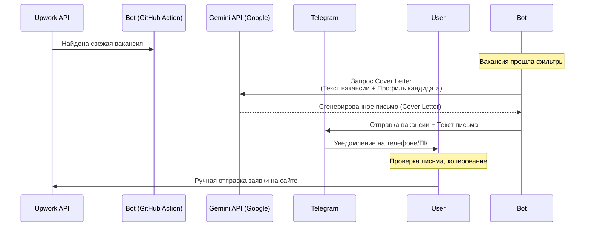

# Интеграция ИИ для генерации сопроводительных писем (Cover Letters)

Этот документ описывает архитектуру, процесс настройки и план внедрения бесплатного ИИ-помощника (на базе **Google Gemini API**) в ваш Upwork-телеграм-бот.

---

## Архитектура решения (Полуавтоматический режим)

Для исключения рисков блокировки аккаунта со стороны Upwork, генерация и отправка заявок разделены: бот берет на себя рутину подготовки качественного текста, а вы осуществляете финальный контроль и отправку.



---

## 1. Подготовка: Получение бесплатного Gemini API Key

Для работы ИИ потребуется бесплатный ключ от Google.
1. Перейдите на платформу **[Google AI Studio](https://aistudio.google.com/)**.
2. Авторизуйтесь под своим аккаунтом Google.
3. Нажмите кнопку **"Create API Key"**.
4. Скопируйте полученный ключ (он начинается на `AIzaSy...`).
5. **Сохранение ключа:**
   * Локально: добавьте ключ в вашу операционную систему или файл конфигурации.
   * На GitHub: перейдите в настройки вашего репозитория (`Settings -> Secrets and variables -> Actions`) и добавьте новый секрет с именем `GEMINI_API_KEY`.

---

## 2. Создание профиля разработчика (`data/resume_profile.txt`)

Бот будет передавать этот профиль ИИ при каждом запросе, чтобы сопроводительное письмо строилось на реальных фактах из вашего опыта.

Создайте файл в репозитории по пути `data/resume_profile.txt` следующего содержания (пример):

```text
ИМЯ: Виталий
РОЛЬ: Fullstack WordPress & WooCommerce Developer
ОПЫТ: 5+ лет коммерческой разработки.

КЛЮЧЕВОЙ СТЕК:
- PHP, JavaScript (React, Next.js, jQuery), HTML5, CSS3/SASS.
- WordPress Core, разработка кастомных плагинов и тем с нуля.
- WooCommerce (кастомизация корзины, чекаута, интеграция платежных шлюзов, оптимизация производительности).
- Page Builders: Bricks Builder, Elementor, Gutenberg (создание кастомных блоков).
- Оптимизация скорости (PageSpeed Insights, Core Web Vitals, кэширование, CDN).
- Интеграция сторонних API (REST API, Webhooks).

ПРИМЕРЫ УСПЕШНЫХ ПРОЕКТОВ:
1. Разработал с нуля сложный плагин бронирования для WooCommerce с интеграцией Google Calendar API.
2. Перенес крупный интернет-магазин (более 10,000 товаров) на Bricks Builder, увеличив скорость загрузки мобильной версии с 30 до 85 баллов по PageSpeed.
3. Оптимизировал базу данных и логику запросов WooCommerce-магазина, что сократило TTFB сервера на 50%.

ТРЕБОВАНИЯ К НАПИСАНИЮ КОВЕРЛЕТЕРА (Инструкции для ИИ):
- Пиши исключительно на английском языке.
- Общайся профессионально, но дружелюбно. Никакой лишней воды, лести и общих фраз вроде "Dear Hiring Manager", "I am writing to express my interest".
- Начинай письмо сразу с сути проблемы клиента (покажи, что ты прочитал описание).
- Если в вакансии есть проверочное слово или скрытый вопрос (например, "напишите 123 в начале"), обязательно начни коверлетер с этого слова/ответа.
- Объем письма: не более 100-150 слов (краткость — приоритет).
```

---

## 3. План изменений в коде бота

Для реализации нам не потребуется ставить тяжелые библиотеки. Мы напишем легкий модуль работы с API Gemini через встроенную функцию `fetch` (Node.js 20+).

### Шаг 3.1. Создание модуля работы с ИИ [`src/gemini.js`](file:///c:/Users/user/Desktop/Telegram-Upwork-Bot/src/gemini.js)
Создаем новый файл, который будет отвечать за отправку запроса в Google Gemini:

```javascript
const fs = require("fs");
const path = require("path");

const GEMINI_API_URL = "https://generativelanguage.googleapis.com/v1beta/models/gemini-1.5-flash:generateContent";

async function generateCoverLetter(jobTitle, jobDescription) {
  const apiKey = process.env.GEMINI_API_KEY;
  if (!apiKey) {
    console.warn("[Gemini] API Key не найден. Пропускаем генерацию Cover Letter.");
    return null;
  }

  // Загружаем профиль разработчика
  const profilePath = path.join(__dirname, "..", "data", "resume_profile.txt");
  let profileContent = "";
  if (fs.existsSync(profilePath)) {
    profileContent = fs.readFileSync(profilePath, "utf-8");
  }

  const prompt = `
You are an AI assistant helping a freelancer write a highly personalized, human-like Upwork cover letter.
Analyze the job description and match it against the freelancer's profile.

Freelancer's Profile:
${profileContent}

Job Title: ${jobTitle}
Job Description:
${jobDescription}

Write a short, engaging, custom cover letter for this job. Keep it under 150 words. Focus on how the freelancer can solve their specific problem. Don't use generic templates.
`;

  try {
    const resp = await fetch(`${GEMINI_API_URL}?key=${apiKey}`, {
      method: "POST",
      headers: { "Content-Type": "application/json" },
      body: JSON.stringify({
        contents: [{ parts: [{ text: prompt }] }]
      })
    });

    if (!resp.ok) {
      console.error(`[Gemini] Ошибка API: ${resp.status} ${await resp.text()}`);
      return null;
    }

    const data = await resp.json();
    return data.candidates?.[0]?.content?.parts?.[0]?.text || null;
  } catch (err) {
    console.error("[Gemini] Не удалось связаться с API:", err.message);
    return null;
  }
}

module.exports = { generateCoverLetter };
```

### Шаг 3.2. Интеграция в основной цикл [`src/index.js`](file:///c:/Users/user/Desktop/Telegram-Upwork-Bot/src/index.js)
В основном файле мы импортируем новый модуль и запрашиваем генерацию письма при успешном прохождении фильтров:

```javascript
// ... в начале файла:
const { generateCoverLetter } = require("./gemini");

// ... внутри цикла обработки вакансий, сразу после прохождения фильтров passesFilters:
const score = calculateScore(job, config.KEYWORDS, config.SCORING_WEIGHTS);

// Генерируем Cover Letter с помощью ИИ
let coverLetter = null;
try {
  coverLetter = await generateCoverLetter(job.title, job.description);
} catch (err) {
  console.error("Ошибка при генерации Cover Letter:", err.message);
}

// Форматируем сообщение (передаем сгенерированный текст в шаблон)
const message = formatJobMessage(job, score, coverLetter);
```

### Шаг 3.3. Обновление шаблона Telegram [`src/telegram.js`](file:///c:/Users/user/Desktop/Telegram-Upwork-Bot/src/telegram.js)
Добавляем вывод сгенерированного письма в отправляемое сообщение в Telegram:

```javascript
function formatJobMessage(job, score, coverLetter) {
  // ... (предыдущий код форматирования)

  let msg = 
    `🔔 <b>[Score: ${score}]</b> ${escapeHtml(job.title)}\n` +
    `${budgetLine}\n` +
    `💵 Client Avg Paid: <b>${avgHourlyRate}</b>\n` +
    `🌍 ${escapeHtml(country)} | ⭐ ${rating} | ${verified} | 📋 ${postedJobs} jobs\n` +
    `${tagsLine}\n` +
    `${escapeHtml(description)}${description.length >= 250 ? "..." : ""}\n\n`;

  if (coverLetter) {
    msg += `🤖 <b>AI Cover Letter Draft:</b>\n<code>${escapeHtml(coverLetter)}</code>\n\n`;
  }

  msg += `🔗 ${jobUrl}`;
  return msg;
}
```

> [!NOTE]
> Текст сопроводительного письма оборачивается в тег `<code>`. В Telegram это делает текст моноширинным, и его можно будет **скопировать в буфер обмена одним тапом по экрану смартфона**, что невероятно удобно при подаче заявок с мобильного телефона.

---

## 4. План на завтра

Когда вы вернетесь, мы:
1. Создадим файл вашего реального профиля `data/resume_profile.txt` (вы предоставите информацию о себе, ваших сильных сторонах и примерах работ).
2. Подключим вызовы к Gemini API.
3. Протестируем генерацию локально на живых вакансиях, чтобы отладить промпт ИИ и получить идеальный тон писем.
4. Зальем изменения на GitHub.
